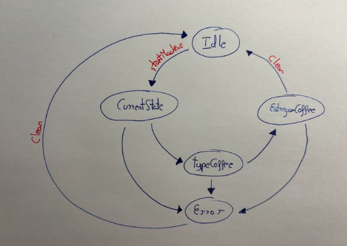

# Maquina de Café - Kotlin

Este proyecto simula el funcionamiento de una máquina de café básica en consola, desarrollada en Kotlin. Permite verificar los recursos, seleccionar tipos de café y manejar errores de forma automática


## Características

- Verificación de los recursos necesarios para preparar café: café, agua, azúcar, leche, vasos y palillos.

- Selección de diferentes tipos de café: Machiatto, Expresso y Americano.

- Manejo de errores si algún recurso no está disponible.

- Limpieza automática de la máquina después de un error.

- Simulación de preparación de café con mensajes y pausas


## Estructura del proyecto

### 1. ```CoffeeMachine```

Objeto singleton que representa la máquina de café.

Propiedades principales:

- ```currentState```: Estado actual de la máquina, basado en CoffeeMachineState.

- ```Interfaz```: Objeto que maneja la interacción con el usuario.

- ```Coffee, Water, Sugar, Milk, Sticks, Cup```: Recursos disponibles en la máquina.

Método principal:

- ```startMachine()```: Controla el flujo principal de la máquina, incluyendo:

  1. Comprobación de estado.

  2. Verificación de recursos.

  3. Solicitud de selección de café.

  4. Manejo de errores y limpieza.


### 2. ```CoffeeMachineState```

Clase sellada que define los posibles estados de la máquina:

- ```Idle```: Máquina inactiva.

- ```checkingStatus```: Verificación inicial del estado de la máquina.

- ```checkingCoffee```: Verificación de café.

- ```checkingWater```: Verificación de agua.

- ```checkingSugar```: Verificación de azúcar.

- ```checkingMilk```: Verificación de leche.

- ```checkingCup```: Verificación de vasos.

- ```checkingSticks```: Verificación de palillos.

- ```orderCoffee```: Estado de selección de café.

- ```Clean```: Estado de limpieza de la máquina.

- ```Error(message: String)```: Estado de error, mostrando un mensaje de fallo.


### 3. ```Coffee```

Clase abstracta que representa un tipo de café.

Propiedades:

- ```name```: Nombre del café.

- ```amountOfWater, amountOfCoffee, amountOfSugar, amountOfMilk```: Cantidad de cada ingrediente.

- ```amountOfSticks```: Cantidad de palillos necesarios (por defecto 1).

- ```amountOfCup```: Cantidad de vasos necesarios (por defecto 1).


Subclases disponibles:

- ```Machiatto```: 0 ml agua, 100 g café, 10 g azúcar, 100 ml leche.

- ```Expresso```: 0 ml agua, 200 g café, 30 g azúcar, 0 ml leche.

- ```Americano```: 200 ml agua, 100 g café, 10 g azúcar, 0 ml leche.


### 4. ```Interface```

Clase que maneja la interacción con el usuario.

Métodos principales:

- ```mostrarMensaje(mensaje: String)```: Muestra un mensaje en la consola.

- ```CoffeeType()```: Solicita al usuario seleccionar un tipo de café y devuelve el objeto correspondiente.

- ```MostrarMensajeError(mensaje: String)```: Muestra un mensaje de error en la consola.

Flujo de selección de café:

1. Muestra un menú con los cafés disponibles.

2. El usuario ingresa un número correspondiente al café deseado.

3. Valida la entrada y solicita reintento si el valor es inválido.

4. Simula la preparación del café con mensajes y pausas.

### Cómo ejecutar el programa

1. Clona el repositorio o copia el código en tu proyecto de Kotlin.

2. Ejecuta el archivo ```main.kt```.

3. La máquina iniciará automáticamente y comprobará los recursos.

4. Selecciona el tipo de café cuando se te solicite ingresando un número del 1 al 3.

5. Si algún recurso no está disponible, se mostrará un mensaje de error y la máquina se limpiará automáticamente.

6. La máquina queda lista para un nuevo ciclo de preparación.

## Esquema



